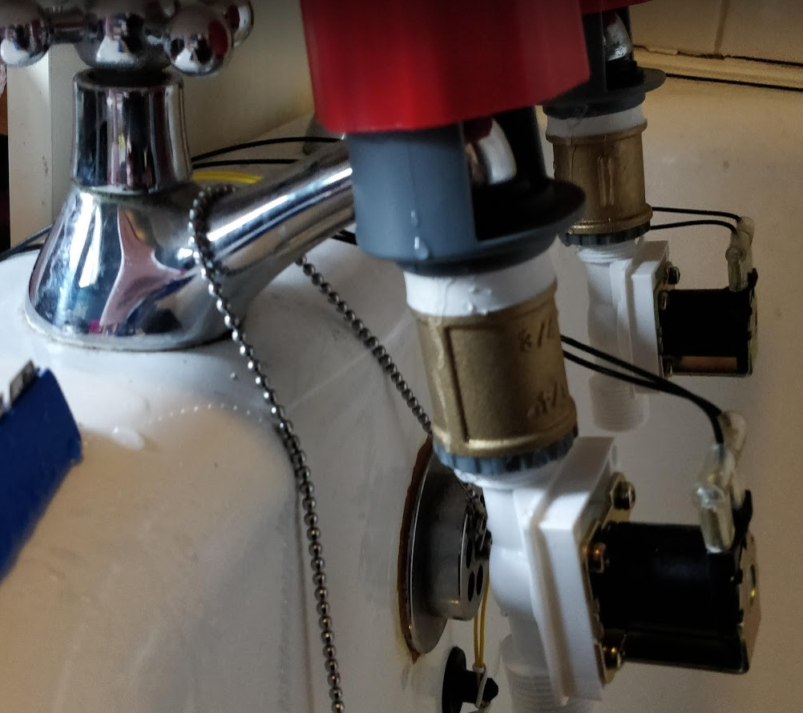
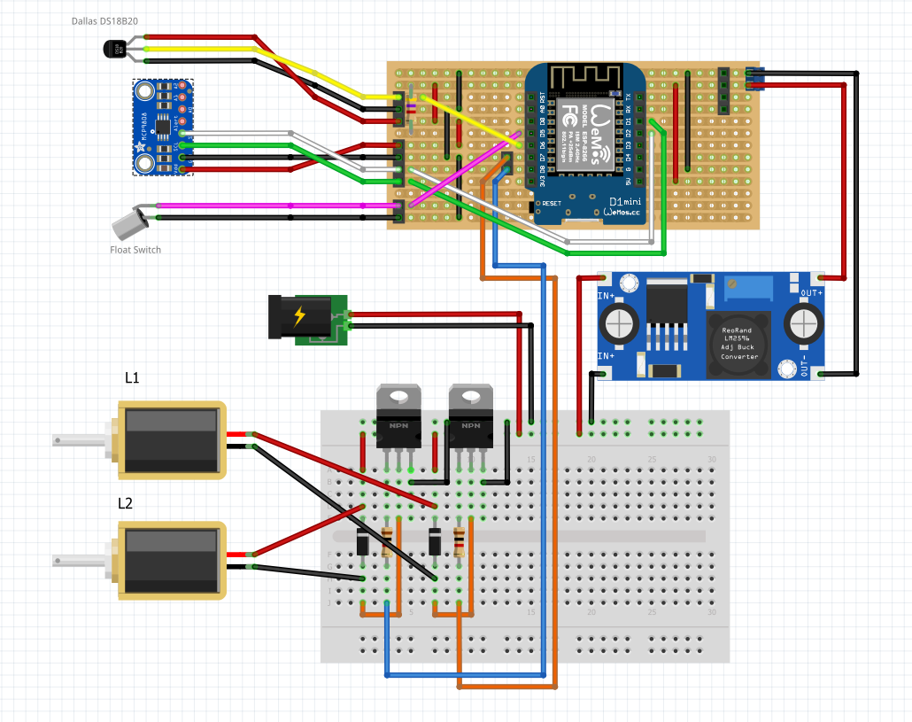
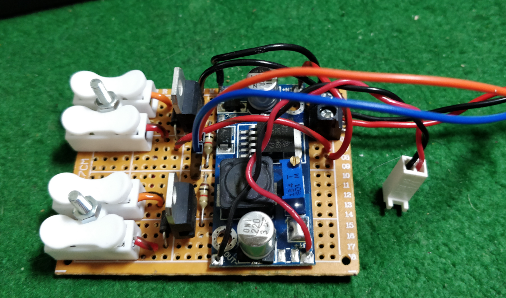

# robotub
RoboTub 10000 - bath preparation automation

# ロボット浴槽10000
Robotto Yokusō 10000


I was enthralled by videos of Japanese automated bathtubs and whilst I am unable to afford such a wonderful consumer item I am able to mess around with modern cheap electronics. My initial aim was to automatically stop the taps when the bath was full. It wouldn't be much more trouble to control the volume of hot and cold water to reach a target temperature. Adding WiFi control is almost trivial with inexpensive ESP8266-based micros! And a project like this keeps me off the streets.

Initial hardware tests are promising: I'm currently using components from online hacker stores, eBay sellers, and high street stores here in the UK.
* The solenoid valves I bought from The Pi Hut here in the UK (£6.50 each https://thepihut.com/products/plastic-water-solenoid-valve-12v-1-2-nominal) and they work well with my hot tap pressure. My water is heated by an ageing gas combi boiler that is quite typical in the UK. I followed instructions from BC Robotics (https://bc-robotics.com/tutorials/controlling-a-solenoid-valve-with-arduino/) using Darlington transistors (TIP120) to switch 12v from the micro.
* The tap connectors are from Wilkos (£3 each https://www.wilko.com/en-uk/wilko-mixer-watering-tap-connector/p/0298812) and are joined to the solenoids with brass 3/4" BSP Female-Female connectors (£1.44 each from Willbond's plumbers merchants)
* The Dallas DS18B20 sensor (£2.49 eBay) is quick to respond to being warmed up, say, by a hand, but when the heat is removed it is slow to cool down again. I'm not sure why this is but I'm gonna go with it since it's cheap and it may be quick enough for this application
* The float switch (£3.49 eBay) is pretty neat and just kinda works.



## PlatformIO
Now ported from an Arduino sketch to PlatformIO (https://platformio.org/)

## ESP8266 D1 Mini Clone
Now running on the very inexpensive D1 Mini: a clone of Wemos D1 Mini R2; board "LOLIN(WEMOS) D1 R2 & mini" in Arduino and board ID "d1_mini" in PlatformIO. Bought for £3.65 from a UK eBay seller but equivalent to this on AliExpress: https://www.aliexpress.com/item/32630518881.html

* NB: This board can only use 2.4GHz networks (same as NodeMCU v1.0)
* Hardware docs for esp8266 modules: https://docs.ai-thinker.com/en/esp8266
* docs for esp8266 Arduino https://arduino-esp8266.readthedocs.io/en/latest/reference.html


```
Pin	Function	ESP-8266 Pin
TX	TXD	TXD
RX	RXD	RXD
A0	Analog input, max 3.3V input	A0
D0	IO	GPIO16
D1	IO, SCL	GPIO5
D2	IO, SDA	GPIO4
D3	IO, 10k Pull-up	GPIO0
D4	IO, 10k Pull-up, BUILTIN_LED	GPIO2
D5	IO, SCK	GPIO14
D6	IO, MISO	GPIO12
D7	IO, MOSI	GPIO13
D8	IO, 10k Pull-down, SS	GPIO15
G	Ground	GND
5V	5V	-
3V3	3.3V	3.3V
RST	Reset	RST
```

Arduino15\packages\esp8266\hardware\esp8266\2.7.4\variants\d1_mini\pins_arduino.h
```
static const uint8_t D0   = 16;
static const uint8_t D1   = 5;
static const uint8_t D2   = 4;
static const uint8_t D3   = 0;
static const uint8_t D4   = 2;
static const uint8_t D5   = 14;
static const uint8_t D6   = 12;
static const uint8_t D7   = 13;
static const uint8_t D8   = 15;
static const uint8_t RX   = 3;
static const uint8_t TX   = 1;
```

```
             +-------------------+
             |      ANTENNA      |
       Reset |x RST          TX x| TXD
max 3.3v  A0 |x A0           RX x| RXD
      GPIO16 |x D0           D1 x| GPIO5 SCL
SCK   GPIO14 |x D5           D2 x| GPIO4 SDA
MISO  GPIO12 |x D6           D3 x| GPIO0 10k Pull-up
MOSI  GPIO13 |x D7           D4 x| GPIO2 10k Pull-up, BUILTIN_LED
SS*   GPIO15 |x D8            G x| GND
         3V3 |x 3V3          5V x| 5V
             |Reset       D1 mini|     (SS* 10k pull-down)
             +-------|USB|-------+
```

Various caveats: -
* GPIO15 (D8) is always pulled low, so you can't use the internal pull-up resistor. You have to keep this in mind when using GPIO15 as an input to read a switch or connect it to a device with an open-collector (or open-drain) output, like I2C.
* GPIO0 (D3) is pulled high during normal operation, so you can't use it as a Hi-Z input.
* GPIO2 (D4) can't be low at boot, so you can't connect a switch to it.

## Fritzing breadboard view

When all the I/O compatibilities are taken account of, we have something like this...



There is just enough I/O on the D1 Mini to support the basic requirements. For anything further I'll be sending serial commands to additional Pro Micro boards

## Solenoid valve driver and power board


All of the 12V stuff is on bit of this crappy protoboard (I hate this stuff but have lots to use up!). The 5V power from the buck regulator and the hot and cold digital control lines connect to the MCU/Sensor connection board.

## NTP to set the clock

On previous projects I was doing way too much work messing around crafting my own NTP packets and decoding responses when it turns out time on the ESP8266 can be set automagically internally with NTP by adding just a couple of lines of code! Here's a sequence of improvements I followed...

* https://github.com/esp8266/Arduino/blob/master/libraries/ESP8266WiFi/examples/NTPClient/NTPClient.ino
* https://github.com/esp8266/Arduino/blob/master/libraries/esp8266/examples/NTP-TZ-DST/NTP-TZ-DST.ino
* https://werner.rothschopf.net/202011_arduino_esp8266_ntp_en.htm

My timezone: Europe/London GMT0BST,M3.5.0/1,M10.5.0

## Multicast UDP messages

I've been messing with UDP multicast for various projects around the house so I can identify and monitor devices without having to know their IP addresses. I have a nice NodeJS module to listen for these messages.

## TCP Server

A simple socket server running on a chosen port or could use a HTTP server and expose a simple web interface.

Tried a few things and found that the WiFiManager (https://github.com/tzapu/WiFiManager)
doesn't play nice with async webserver and khoih-prog/ESPAsync_WiFiManager just doesn't
work reliably on my D1 mini for some reason.
So using the simplest possible webserver and a websocket conenction to hand out the current status information.

## Add-on temperature display

I do like 7-Segment displays! There's not many pins on the D1 Mini so perhaps use an additional cheap micro like a ProMini to do that for me and drive it over the serial.
Mine is labelled SMA420564
https://wokwi.com/arduino/libraries/SevSeg/SevSeg_Counter

## PID control for temperature

(proportional-integral-derivative controller)
* https://www.youtube.com/watch?v=LXhTFBGgskI
* https://playground.arduino.cc/Code/PIDLibrary/
* http://brettbeauregard.com/blog/2011/04/improving-the-beginners-pid-introduction/

## Additional MCP9808 temperature sensor

The MCP9808 might be more accurate and/or responsive so testing one.
Unfortunately it isn't in a nicely waterproofed housing so I'll have to pot it in epoxy resin or similar.

* MCP9808 vs Dallas DS18B20
* using arduino wire
* shuffle all connections around so they fit (and work!)

## Webserver

The built in webserver is mainly showing a chart of temperature and providing simple controls.
The charting is a perfomance hog though and I really should migrate the chart.js to 3.0.
I don't think my use-case is particularly uncommon so it should be an easy upgrade!
